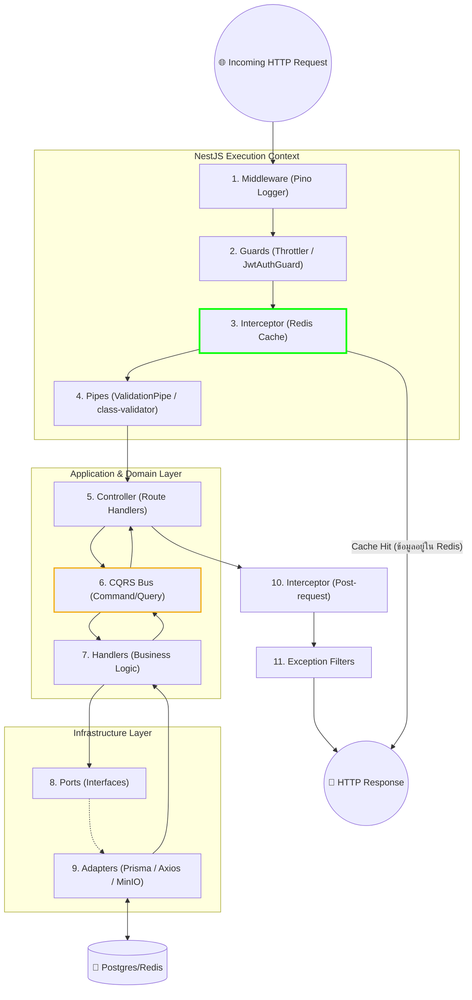
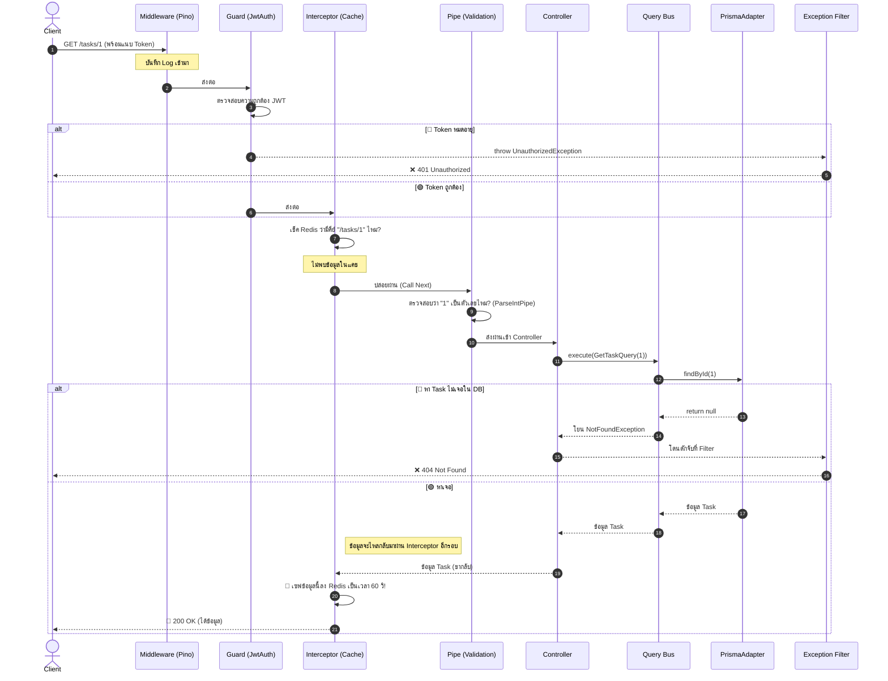

# 🚀 NestJS Full Request Lifecycle (ฉบับเจาะลึกโปรเจกต์ Phase-One)

เอกสารนี้จะกาง **"วงจรชีวิตมาตรฐานของ NestJS (Request Lifecycle)"** แบบเป็นทางการ และนำมาทาบกับ **"โค้ดจริงๆ ในโปรเจกต์นี้"** เพื่อให้คุณเห็นภาพว่า ทฤษฎีของ NestJS ถูกนำมาสร้างเป็น Hexagonal Architecture และ CQRS ในโปรเจกต์นี้ได้อย่างไร

---

## 🔁 1. ภาพรวมลำดับการทำงาน (The Official NestJS Lifecycle)

ตามมาตรฐานของ NestJS เมื่อมี Request เข้ามา มันจะต้องผ่านขั้นตอนเหล่านี้ตามลำดับเป๊ะๆ (สังเกตเครื่องหมาย 📌 คือจุดที่เรามีการเขียนโค้ดใช้งานจริงในโปรเจกต์นี้)

1. `Incoming Request` (ลูกค้าเรียก API)
2. `Middleware` 📌 *(Pino Logger)*
3. `Guards` 📌 *(Throttler, JwtAuthGuard)*
4. `Interceptors (Pre-controller)` 📌 *(CacheInterceptor)*
5. `Pipes` 📌 *(ValidationPipe)*
6. `Controller` 📌 *(TasksController, UsersController)*
7. `Service / Business Logic` 📌 *(CQRS Handlers, Hexagonal Ports/Adapters)*
8. `Interceptors (Post-request)` *(ไม่ได้ใช้แบบ Custom เพิ่มเติม)*
9. `Exception Filters` 📌 *(ดักจับ Error ทั่วไป และ Prisma Errors)*
10. `Server Response` (ส่งข้อมูลกลับ)

---

## 🧩 2. เจาะลึกทีละด่าน พร้อมตัวอย่างโค้ดในโปรเจกต์

### ด่านที่ 1: Middleware (ด่านหน้าสุด)
**สิ่งที่เราใช้:** `pino-http` (ผ่าน `nestjs-pino`)
**มันอยู่ตรงไหน:** ในไฟล์ `app.module.ts` เรา `LoggerModule.forRoot()`
**หน้าที่:** ทันทีที่ Request แตะเซิร์ฟเวอร์ มันจะสร้าง Log ขึ้นมาทันทีว่าใครเข้ามาทำอะไร และใช้เวลาเท่าไหร่

### ด่านที่ 2: Guards (ยามเฝ้าประตู)
**สิ่งที่เราใช้:** 
1. `ThrottlerGuard` (จำกัด Rate Limit กันโดนยิงสแปม)
2. `JwtAuthGuard` (ตรวจ JWT Token ของ User)
**มันอยู่ตรงไหน:** `app.module.ts` (Global Throttler) และ `auth/guards/jwt-auth.guard.ts`

### ด่านที่ 3: Interceptors (พนักงานหน้าห้อง)
**สิ่งที่เราใช้:** `CacheInterceptor` 
**มันอยู่ตรงไหน:** ใน `app.module.ts` เราเปิดใช้แบบ Global 
**หน้าที่:** ถ้าเป็น HTTP `GET` มันจะเช็คว่าใน Redis มีข้อมูลตอบกลับของ URL นี้ไหม ถ้ามี มันจะ **"กระโดดข้ามด่านที่ 4-7"** แล้วส่งข้อมูลกลับทันที! (นี่คือความทรงพลังของ Interceptor)

### ด่านที่ 4: Pipes (พนักงานคัดกรองข้อมูล)
**สิ่งที่เราใช้:** `ValidationPipe`
**มันอยู่ตรงไหน:** `main.ts` (`app.useGlobalPipes(new ValidationPipe({...}))`)
**หน้าที่:** ตรวจสอบ Request Body เช่น ตรวจ `CreateTaskDto` ว่าแนบ `title` มาไหม? ถ้าไม่ได้แนบมา Pipe จะโยน `BadRequestException` ออกไปทันที

### ด่านที่ 5: Controller (ผู้รับเรื่อง)
**สิ่งที่เราใช้:** เช่น `TasksController` (`tasks.controller.ts`)
**หน้าที่:** รับข้อมูลที่สะอาดแล้วจาก Pipe และ **"ไม่ลงมือทำเอง"** แต่จะโยนเข้าสู่ระบบ CQRS:
```typescript
@Post()
async createTask(@Body() dto: CreateTaskDto) {
  // ไม่เรียก Service ตรงๆ แต่โยน Command เข้า Bus
  return this.commandBus.execute(new CreateTaskCommand(dto)); 
}
```

### ด่านที่ 6: แก่นของระบบ (CQRS + Hexagonal Architecture)
จุดนี้คือด่านที่ 7 ตามมาตรฐาน (Service) แต่เราขยายโครงสร้างให้เป็นระดับ Enterprise:
1. **CQRS Bus:** คอยแยกจดหมาย (Command/Query) ไปส่งให้ Handler ที่ถูกต้อง
2. **Handler:** เช่น `CreateTaskHandler` จะเป็นคนคิด Business Logic (ตัวอย่างเช่น ไปดึงคำคมจาก External API)
3. **Ports:** Handler จะสั่งเซฟข้อมูลผ่าน `ITaskRepository` (ไม่สนใจว่าข้างล่างใช้ Database อะไร)
4. **Adapters:** `PrismaTaskRepository` รับคำสั่งจาก Port แล้วไปแปลงเป็น SQL ยิงเข้า PostgreSQL ผ่าน Prisma

### ด่านที่ 7: Exception Filters (แผนกเยียวยา)
**สิ่งที่เราใช้:** ระบบ Filter พื้นฐานของ NestJS
**หน้าที่:** ไม่ว่าด่านไหน (ตั้งแต่ 2-6) เกิด Error หรือพ่น `throw new NotFoundException()` ออกมา ระบบ Filter จะดักจับแล้วแปลงเป็น JSON สวยๆ ส่งกลับไปเสมอ

---

## 📊 3. Flowchart: ลำดับชั้นตามหลักการของ NestJS ในโปรเจกต์เรา

แผนผังนี้แสดง Layer ตามทฤษฎีเป๊ะๆ โดยจัดเรียงจาก นอกสุด สู่ ในสุด:



---

## ⚙️ 4. Sequence Diagram: เจาะลึกจังหวะเวลา (Timeline)

เรามาดูสถานการณ์ยอดฮิต: **"ดึงข้อมูล Task ที่ไม่เคยแคชมาก่อน"** เพื่อดูว่า Request วิ่งผ่าน Lifecycle แต่ละจุดยังไง



### 💡 จุดสังเกตที่สำคัญ
1. **Lifecycle แบบหัวหอม (Onion):** Request จะวิ่งจากซ้ายไปขวา (ขาไป) และวิ่งจากขวาไปซ้าย (ขากลับ)
2. **Interceptor อยู่คร่อมกลาง:** สังเกตเส้นของ `Cache Interceptor` มันทำงานทั้ง **ขาไป** (เช็คว่ามีแคชไหม) และ **ขากลับ** (เอาผลลัพธ์ใหม่ไปเซฟลง Redis) นี่คือความสามารถเฉพาะตัวของ Interceptor ใน NestJS ครับ!
