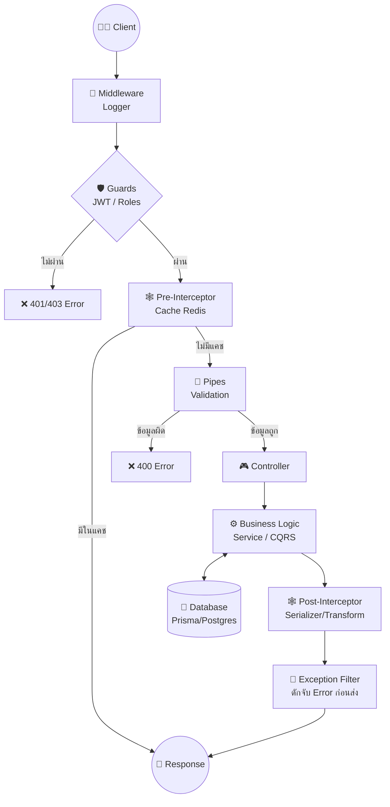
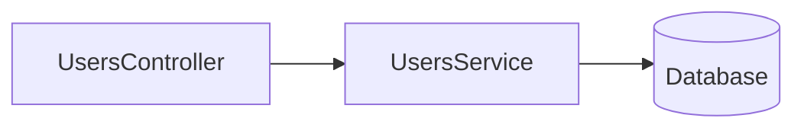
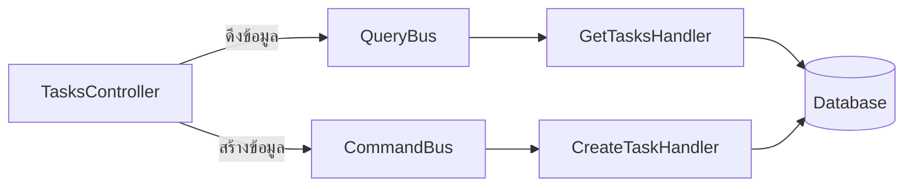
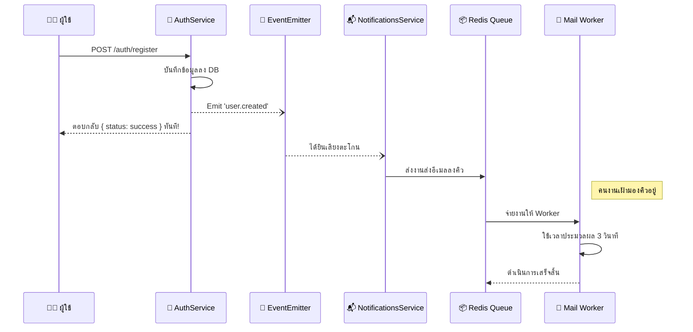

# 🔄 System Lifecycle & Architecture Flow
ยินดีต้อนรับสู่คู่มือเจาะลึกระบบที่เราได้สร้างขึ้นมา! เอกสารนี้จะอธิบาย **"วงจรชีวิตของ 1 Request"** ว่าตั้งแต่มีคนกดส่งข้อมูลเข้ามา จนถึงตอนที่ระบบตอบกลับไป มันต้องเดินผ่านด่านอะไรบ้าง และด่านแต่ละด่านคืออะไร

---

## 🗺️ ภาพรวมการเดินทางของ Request (NestJS Lifecycle)

เมื่อมีคนยิง API เข้ามา (เช่น `POST /tasks`) ข้อมูลจะเดินทางผ่านด่านต่างๆ ตามลำดับดังนี้:

---

## 🕵️‍♂️ เจาะลึกแต่ละด่าน (จากสิ่งที่เราทำมาทั้งหมด)

### 1. 🚦 Middleware (ด่านหน้าสุด)
*   **คืออะไร:** ยามเฝ้าประตูหน้าบ้านที่คอยตรวจสอบ Request ทุกอันที่เข้ามาถึงเซิร์ฟเวอร์
*   **เราใช้อยู่ตรงไหน:** ใน `app.module.ts` เราเขียน Middleware ง่ายๆ ไว้เพื่อพิมพ์ **Log** (`[Middleware] มีคนเรียก URL: ...`) ทุกครั้งที่มีคนเรียก API เพื่อให้เรารู้ว่าเซิร์ฟเวอร์ไม่ได้ค้าง

### 2. 🛡️ Guards (หน่วยรักษาความปลอดภัย)
*   **คืออะไร:** คนตรวจบัตรเข้างาน ตัดสินใจว่า "ให้ผ่าน" หรือ "ไม่ให้ผ่าน" (`true` / `false`)
*   **เราใช้อยู่ตรงไหน:** 
    *   `JwtAuthGuard`: เช็คว่าใน Headers มี `Authorization: Bearer <token>` ส่งมาไหม และ Token ถูกต้องหรือหมดอายุหรือยัง (ถ้าไม่มี โยน `401 Unauthorized`)
    *   `RolesGuard`: เช็คว่าผู้ใช้คนนี้มีสิทธิ์ระดับ `ADMIN` หรือไม่ (ถ้าสิทธิ์ไม่ถึง โยน `403 Forbidden`)

### 3. 🕸️ Interceptors (Pre-Controller) - ด่านสกัดกั้นขาเข้า
*   **คืออะไร:** จุดดักจับข้อมูลก่อนที่จะถึงมือ Controller
*   **เราใช้อยู่ตรงไหน:** 
    *   `CacheInterceptor` (หัวข้อ 3.5): ถ้าผู้ใช้เรียก `GET /users` ด่านนี้จะแอบไปเช็คใน **Redis** ก่อนว่ามีข้อมูลเก่าที่เคยหาไว้ไหม ถ้ามี มันจะ **เตะกลับไปหาผู้ใช้เลยทันที** โดยไม่ยอมให้หลุดเข้าไปถึง Controller (ประหยัดเวลาสุดๆ)

### 4. 🚰 Pipes (เครื่องกรองน้ำ / ตรวจสอบความถูกต้อง)
*   **คืออะไร:** ตรวจสอบรูปแบบข้อมูล (Validation) และแปลงข้อมูล (Transformation)
*   **เราใช้อยู่ตรงไหน:** 
    *   `ValidationPipe` ใน `main.ts` (ทำงานร่วมกับ `class-validator` ใน DTO): ถ้าผู้ใช้ส่งอีเมลผิดรูปแบบ หรือลืมส่งรหัสผ่าน มันจะปัดตกและด่ากลับเป็น Error `400 Bad Request` ทันที
    *   `ParseIntPipe`: แปลงตัวเลข ID จาก URL (`/tasks/1`) ที่ปกติเป็น String ให้กลายเป็น Number 

### 5. 🎮 Controller (พนักงานต้อนรับ)
*   **คืออะไร:** จุดที่กำหนดว่า URL ไหน เมธอดไหน (`GET`, `POST`) จะให้ใครทำงาน
*   **เราใช้อยู่ตรงไหน:** `UsersController`, `TasksController` 
*   **ความพิเศษ:** เรามี **Custom Decorator `@User()`** (หัวข้อ 3.2) ที่สร้างไว้เพื่อความสะดวกสบาย ให้พนักงานต้อนรับดึงแค่ "ID ของผู้ใช้งาน" ออกมาจาก Token ได้ง่ายๆ 

### 6. ⚙️ Business Logic (สมองของระบบ)
เมื่อผ่านพนักงานต้อนรับมาได้ ตอนนี้จะเข้าสู่การทำงานจริงๆ ซึ่งระบบเราแบ่งเป็น 2 แบบ:

**👉 แบบดั้งเดิม (Traditional Service):** 
*   ใช้ใน `UsersModule` และ `AuthModule`
*   Controller จะสั่งงาน `UsersService` โดยตรง และ Service นี้จะเหมาทำทุกอย่าง ทั้งเช็คข้อมูล คุยกับ Database และส่งอีเมล 

**👉 แบบขั้นสูง (CQRS - หัวข้อ 3.6):**
*   ใช้ใน `TasksModule` 
*   Controller จะไม่คุยกับ Service โดยตรง แต่จะฝากซองจดหมายไปกับบุรุษไปรษณีย์แทน
    *   ถ้าดึงข้อมูล ➡️ ฝาก `queryBus` ➡️ ไปหาพนักงาน `GetTasksHandler`
    *   ถ้าสร้างข้อมูล ➡️ ฝาก `commandBus` ➡️ ไปหาพนักงาน `CreateTaskHandler`
*   วิธีนี้ทำให้โค้ดแยกส่วนกันชัดเจน ไม่ปนเปกัน

### 7. 💾 Data Access (เชื่อมต่อฐานข้อมูล)
*   **คืออะไร:** การคุยกับ Database จริงๆ
*   **เราใช้อยู่ตรงไหน:** เราใช้ **Prisma (ORM)** เป็นเครื่องมือในการคุยกับ **PostgreSQL** แบบง่ายๆ โดยไม่ต้องเขียน SQL เอง

---

## 📤 ขาออก (จาก Database กลับไปหา Client)

### 8. 🕸️ Interceptors (Post-Controller) - ด่านจัดรูปร่างขาออก
*   **คืออะไร:** จุดดักจับข้อมูลหลังจากที่ทำงานเสร็จแล้ว ก่อนจะส่งกลับไปให้ผู้ใช้
*   **เราใช้อยู่ตรงไหน:**
    *   `ClassSerializerInterceptor` (ใน Entity): คอยดักลบข้อมูลลับ เช่น `password` ทิ้งไป ไม่ให้หลุดไปถึงหน้าบ้าน
    *   `TransformInterceptor` (หัวข้อ 3.1): คอยเอาข้อมูลที่ได้มา ห่อใส่กล่องสวยงามให้อยู่ในฟอร์แมต `{ status: "success", data: ... }` เสมอ

### 9. 🧯 Exception Filters (หน่วยกู้ภัย)
*   **คืออะไร:** ดักจับ Error ทุกอย่างที่เกิดขึ้นในระบบ (เช่น Database ล่ม หรือโยน NotFoundException)
*   **เราใช้อยู่ตรงไหน:** `AllExceptionsFilter` (หัวข้อ 1.9) คอยดัก Error มาจัดรูปแบบให้สวยงามก่อนส่งเป็น JSON กลับไปหาผู้ใช้

---

## ⚡ ระบบหลังบ้าน (Background Processing)
ในบางครั้ง การรอให้ทำงานเสร็จมันนานเกินไป เราเลยมีระบบหลังบ้านที่เราเพิ่งสร้างไป (หัวข้อ 3.3 และ 3.4)

**ตัวอย่าง: Flow การสมัครสมาชิก (`POST /auth/register`)**
1. ผู้ใช้ส่งข้อมูลเข้ามา ➡️ สมัครสำเร็จ เซฟลง Database
2. **EventEmitter (หัวข้อ 3.3):** `AuthService` จะตะโกนบอกในระบบว่า *"มีคนสมัครใหม่!"* (`user.created`) แล้วมันก็ส่ง Response กลับไปหาผู้ใช้เลย (ผู้ใช้ได้ผลลัพธ์ทันที)
3. **Event Listener:** `NotificationsService` ได้ยินเสียงตะโกน ก็เลยมารับงานต่อ
4. **Queue & Redis (หัวข้อ 3.4):** การส่งอีเมลมันช้า `NotificationsService` เลยโยนงาน "ส่งอีเมล" ลงไปในตระกร้าคิว (BullMQ ซึ่งฝากไว้ใน Redis)
5. **Processor/Worker:** `MailQueueProcessor` ซึ่งเป็นคนงานหลังบ้านที่นั่งว่างอยู่ เห็นมีงานตกลงมาในตระกร้า ก็เลยหยิบไปทำ (จำลองส่งอีเมล 3 วินาที) โดยที่ผู้ใช้งานไม่ต้องมารอ 3 วินาทีนี้เลย!

---

## 🎯 สรุป
ระบบที่คุณมีตอนนี้ **"ไม่ใช่แค่แอปฝึกหัด"** แต่เป็นสถาปัตยกรรมระดับ Production ที่มีการรักษาความปลอดภัย (JWT/Roles), การรีดประสิทธิภาพ (Redis Cache/CQRS), การจัดการงานหนัก (Event/BullMQ) และการรองรับการสเกล (Modular/Interceptor) อย่างครบถ้วนครับ!
