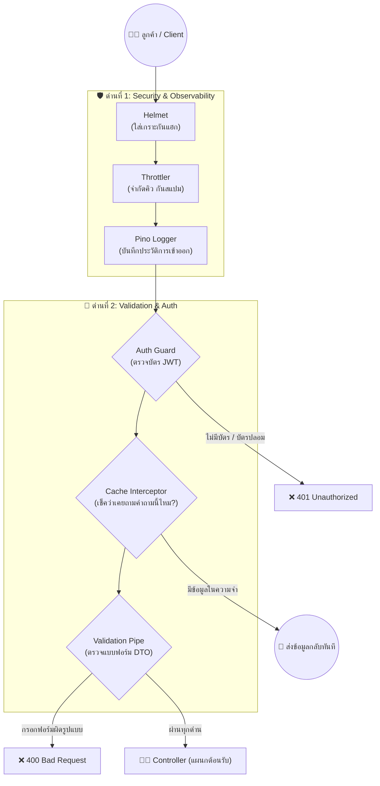
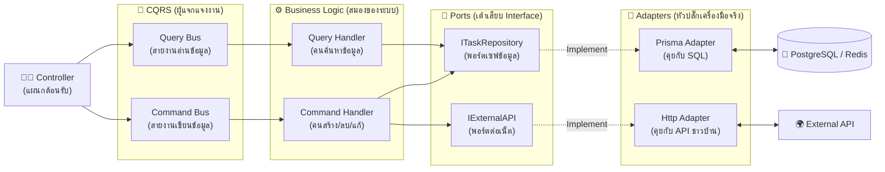
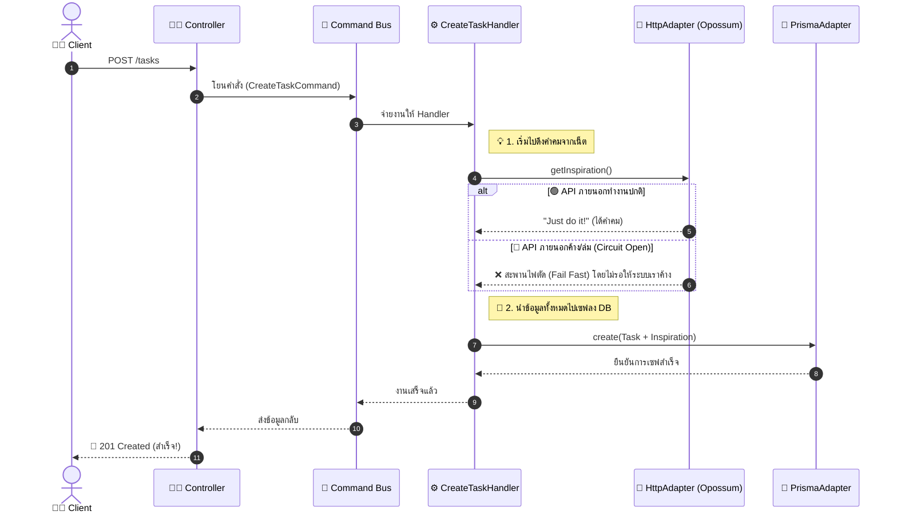
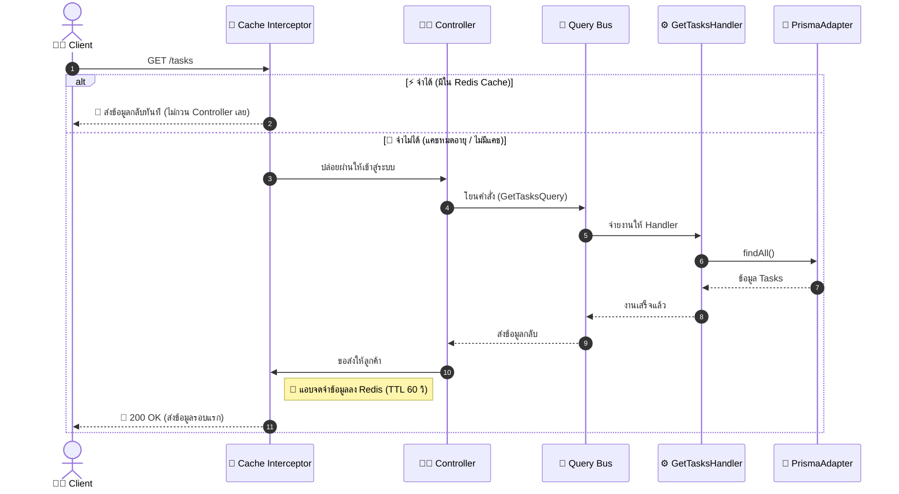
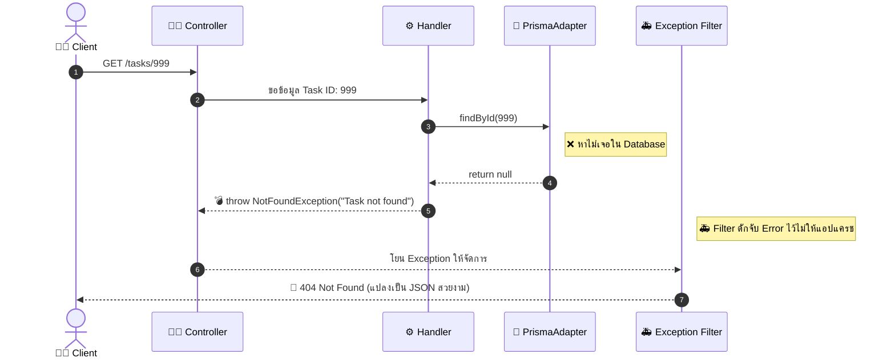

# 🔄 System Lifecycle: เจาะลึกการเดินทางของระบบ (แบบแยกส่วนให้เข้าใจง่าย)

เพื่อให้เห็นภาพที่ชัดเจนที่สุดและไม่ปวดหัวกับ "เส้นที่พันกันยุ่งเหยิง" เราจะซอยย่อยระบบออกเป็น 3 ส่วนหลัก ได้แก่ **1. ด่านหน้า (Global Pipeline)**, **2. โครงสร้างหลัก (Core Architecture)**, และ **3. สถานการณ์จำลอง (Sequence Flow)** ครับ

---

## 1️⃣ ด่านหน้า: Global Request Pipeline
นี่คือสิ่งที่เกิดขึ้น **"ก่อนที่ข้อมูลจะไปถึง Controller"** ระบบจะทำการกรองและตรวจสอบความปลอดภัยเป็นลำดับชั้น (เรียงจากบนลงล่าง):

---

## 2️⃣ โครงสร้างหลัก: Core Architecture (CQRS & Hexagonal)
เมื่อคำสั่งทะลุด่านหน้ามาถึง **Controller** นี่คือภาพรวมการทำงานของ "แก่นของแอปพลิเคชัน (Domain)" ที่แยกส่วนประกอบต่างๆ ออกจากกันอย่างเด็ดขาด (อ่านจากซ้ายไปขวา):

---

## 3️⃣ สถานการณ์จำลอง (Sequence Diagrams)

เพื่อให้เห็นภาพเวลาทำงานจริงว่า "ใครคุยกับใครก่อนหลัง" เรามาดู **3 สถานการณ์ยอดฮิต** ที่เกิดขึ้นในระบบของเรากันครับ:

### Flow A: การสร้างงานใหม่ (มี Circuit Breaker ป้องกัน API ล่ม)
**สถานการณ์:** ลูกค้าส่งคำสั่ง `POST /tasks` เพื่อสร้างงานใหม่ ซึ่งเราต้องไปขอ "คำคม (Inspiration)" จากเว็บอื่นมาแปะไว้ด้วย

### Flow B: การดึงข้อมูลที่มีแคช (Cache Hit & Query Flow)
**สถานการณ์:** ลูกค้าเรียกดูรายการ Task (`GET /tasks`) ซึ่งข้อมูลนี้เคยถูกดึงไปแล้วเมื่อ 5 วินาทีก่อน

### Flow C: การจัดการเมื่อเจอข้อผิดพลาด (Exception Handling)
**สถานการณ์:** ลูกค้าพยายามค้นหา Task ที่ไม่มีอยู่จริงในฐานข้อมูล

